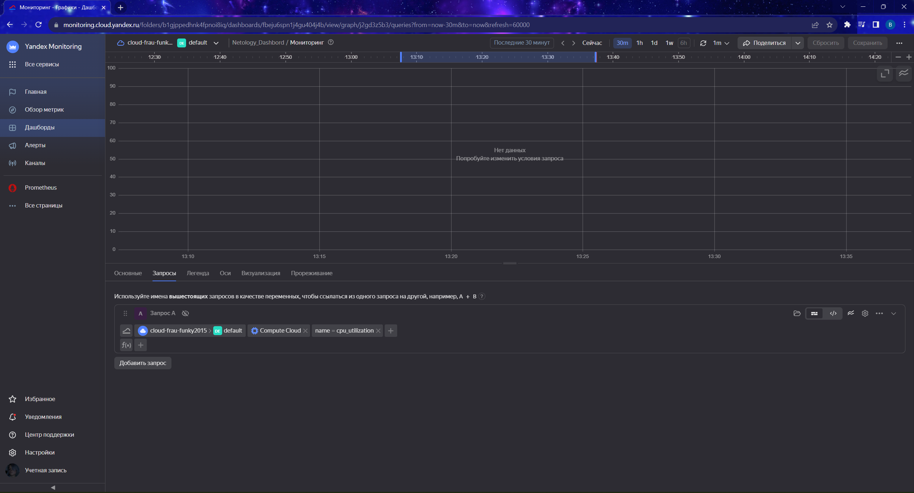

# Домашнее задание к занятию «Обзор систем IT-мониторинга»

# Задание 1

Создайте виртуальную машину в Yandex Compute Cloud и с помощью Yandex Monitoring создайте дашборд, на котором будет видно загрузку процессора.

1. Процесс выполнения
2. В окне браузера откройте облачную платформу Yandex Cloud
3. Перейдите в раздел "Все сервисы" > "Инфраструктура и сеть" > "Compute Cloud"
4. Нажмите на синюю кнопку "Создать ВМ" в правом верхнем углу окна браузера
5. Задайте имя виртуальной машины. Используйте английские буквы и цифры.
6. Выберите операционную систему Debian 11
7. Установите объём HDD равный 3ГБ
8. Выберите платформу Intel Ice Lake
9. Установите количество vCPU равное 2
10. Установите гарантированную долю vCPU равную 20%
11. Задайте количество RAM равное 1ГБ
12. Поставьте галочку "Прерываемая"
13. В разделе "Доступ" выберите сервисный аккаунт с ролью monitoring.editor. Если такого аккаунта нету, нажмите на кнопку "Создать новый". Задайте имя аккаунта английскими буквами, напротив надписи "Роли в каталоге" нажмите на знак "плюс". Прокручивая колесо мыши на себя, найдите роль monitoring.editor и нажмите на неё левой кнопкой мыши. Теперь вы сможете найти только что созданную роль в выпадающем списке аккаунтов.
14. Задайте логин учётной записи вашей виртуальной машины
15. Вставьте публичный SHH-ключ в поле SSH-ключ. Если этого ключа у вас нету, создайте его с помощью утилиты PuTTYgen
16. Поставьте галочку "Установить" в пункте "Агент сбора метрик"
17. Нажмите на синюю кнопку "Создать ВМ"
18. Перейдите в раздел "Все сервисы" > "Инфраструктура и сеть" > "Monitoring"
19.Нажмите на кнопку "Создать дашборд", расположенную в разделе "Возможности сервиса" > "Дашборды"
20. В открывшемся окне в разделе "Добавить виджет" нажмите на "График"
21. Пред вам предстанет конструктор запросов, выберите "Запрос А"
22. В параметре service конструктора запросов выберите Compute Cloud
23. В появившемся параметре name конструктора запросов выберите cpu_utilization
24. Поправьте диапазон времени отрисовки графика нажав на кнопку "Сейчас" в верху экрана, левее кнопок 3m, 1h, 1d, 1w, "Отменить".
25. Нажмите на кнопку "Сохранить" в правом верхнем углу экрана
26. Задайте имя дашборда, если появится окно ввода имени дашборда
27. Сделайте скриншот

