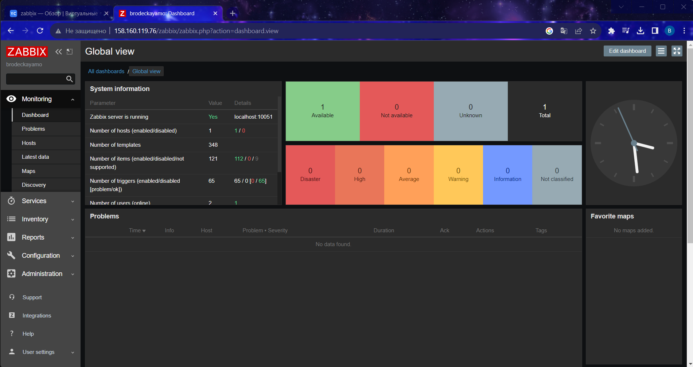

## Домашнее задание к занятию «Система мониторинга Zabbix»

# Задание 1

Установите Zabbix Server с веб-интерфейсом.

Процесс выполнения

Выполняя ДЗ, сверяйтесь с процессом отражённым в записи лекции.
Установите PostgreSQL. Для установки достаточна та версия, что есть в системном репозитороии Debian 11.
Пользуясь конфигуратором команд с официального сайта, составьте набор команд для установки последней версии Zabbix с поддержкой PostgreSQL и Apache.
Выполните все необходимые команды для установки Zabbix Server и Zabbix Web Server.

Требования к результату

Прикрепите в файл README.md скриншот авторизации в админке.

Приложите в файл README.md текст использованных команд в GitHub.

# Задание 2

Установите Zabbix Agent на два хоста.

Процесс выполнения

Выполняя ДЗ, сверяйтесь с процессом отражённым в записи лекции.
Установите Zabbix Agent на 2 вирт.машины, одной из них может быть ваш Zabbix Server.
Добавьте Zabbix Server в список разрешенных серверов ваших Zabbix Agentов.
Добавьте Zabbix Agentов в раздел Configuration > Hosts вашего Zabbix Servera.
Проверьте, что в разделе Latest Data начали появляться данные с добавленных агентов.

Требования к результату

Приложите в файл README.md скриншот раздела Configuration > Hosts, где видно, что агенты подключены к серверу

Приложите в файл README.md скриншот лога zabbix agent, где видно, что он работает с сервером

Приложите в файл README.md скриншот раздела Monitoring > Latest data для обоих хостов, где видны поступающие от агентов данные.

Приложите в файл README.md текст использованных команд в GitHub

